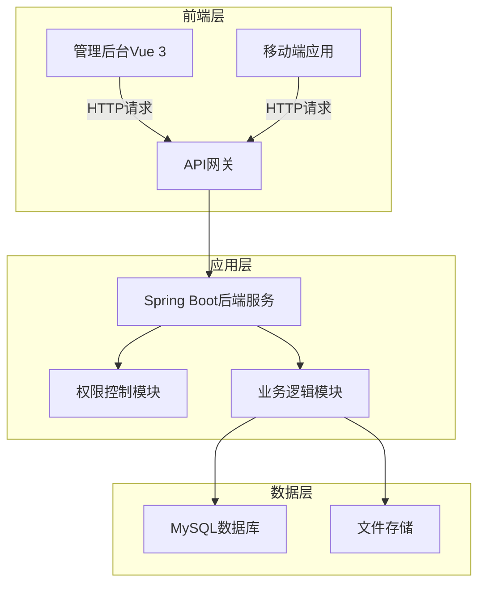

# 外卖管理系统

## 项目简介

外卖管理系统是一个基于Spring Boot + Vue 3的全栈外卖业务管理平台，提供完整的餐厅运营管理解决方案。系统包含管理后台和移动端两部分，支持分店管理、菜品管理、套餐管理、订单管理等核心功能，帮助餐厅实现数字化运营。

## 系统架构



## 核心功能模块

### 1. 分店管理
- 分店信息CRUD操作
- 分店状态管理（启用/禁用）
- 分店数据统计

### 2. 分类管理
- 菜品分类管理
- 套餐分类管理
- 分类排序与状态控制

### 3. 菜品管理
- 菜品基本信息管理
- 菜品图片上传
- 菜品状态控制
- 菜品批量导入导出

### 4. 套餐管理
- 套餐组合配置
- 套餐价格与菜品关联
- 套餐状态管理

### 5. 订单管理
- 订单信息查询
- 订单状态更新
- 订单数据统计分析

### 6. 员工管理
- 员工信息管理
- 角色权限分配
- 员工登录认证

## 技术栈

### 后端技术栈
| 技术 | 版本 | 用途 |
|------|------|------|
| Spring Boot | 3.1.10 | 后端框架 |
| Spring Security | 6.1.0 | 安全认证 |
| MyBatis Plus | 3.5.3.1 | ORM框架 |
| MySQL | 8.0 | 关系型数据库 |
| JWT | 0.11.5 | 身份认证 |
| Lombok | 1.18.26 | 简化代码 |
| Knife4j | 4.3.0 | API文档 |

### 前端技术栈
| 技术 | 版本 | 用途 |
|------|------|------|
| Vue | 3.3.4 | 前端框架 |
| Element Plus | 2.3.8 | UI组件库 |
| Axios | 1.4.0 | HTTP客户端 |
| Vue Router | 4.2.4 | 路由管理 |
| Pinia | 2.1.6 | 状态管理 |

## 项目结构

```
deliverManagement/
├── src/
│   ├── main/
│   │   ├── java/com/delivery/management/      # 后端Java代码
│   │   │   ├── entity/                       # 实体类
│   │   │   ├── mapper/                       # Mapper接口
│   │   │   ├── service/                      # 业务逻辑
│   │   │   ├── controller/                   # 控制器
│   │   │   ├── config/                       # 配置类
│   │   │   └── DeliverManagementApplication.java # 启动类
│   │   └── resources/                        # 资源文件
│   │       ├── mapper/                       # MyBatis映射文件
│   │       └── application*.yml              # 配置文件
│   └── test/                                 # 测试代码
├── src/                                      # 前端Vue代码
│   ├── api/                                  # API请求
│   ├── components/                           # 公共组件
│   ├── views/                                # 页面组件
│   ├── router/                               # 路由配置
│   ├── stores/                               # 状态管理
│   └── main.js                               # 入口文件
├── init.sql                                  # 数据库初始化脚本
├── test_data.sql                             # 测试数据脚本
├── pom.xml                                   # Maven配置
├── package.json                              # npm配置
├── 接口文档.md                                # API接口文档
└── README.md                                 # 项目说明文档
```

## 快速开始

### 环境要求

- JDK 17+
- MySQL 8.0+
- Node.js 16+

### 数据库配置

1. 创建数据库
   ```sql
   CREATE DATABASE deliver_management CHARACTER SET utf8mb4 COLLATE utf8mb4_unicode_ci;
   ```

2. 导入初始化脚本
   ```bash
   # 导入表结构
   mysql -u root -p deliver_management < init.sql
   
   # 导入测试数据（可选）
   mysql -u root -p deliver_management < test_data.sql
   ```

### 后端启动

1. 修改配置文件
    - 编辑 `src/main/resources/application.yml`
    - 配置数据库连接信息

2. 启动后端服务
    ```bash
    # 方式1：直接运行启动类
    # 运行 DeliverManagementApplication.java
    
    # 方式2：Maven命令
    mvn spring-boot:run
    ```

3. 访问API文档
   - 地址：http://localhost:8080/doc.html
   - 用户名/密码：admin/123456

### 前端启动

1. 安装依赖
   ```bash
   npm install
   ```

2. 启动开发服务器
   ```bash
   npm run dev
   ```

3. 访问管理后台
   - 地址：http://localhost:5173
   - 用户名/密码：admin/123456

## 部署说明

### 后端部署

```bash
# 打包项目
mvn clean package -Pprod

# 运行jar包
java -jar target/deliver-management-1.0.0.jar --spring.profiles.active=prod
```

### 前端部署

```bash
# 构建生产版本
npm run build

# 将dist目录部署到Nginx或其他Web服务器
```

Nginx配置示例：
```nginx
server {
    listen 80;
    server_name your-domain.com;
    
    location / {
        root /path/to/dist;
        index index.html;
        try_files $uri $uri/ /index.html;
    }
    
    location /api/ {
        proxy_pass http://localhost:8080/;
        proxy_set_header Host $host;
        proxy_set_header X-Real-IP $remote_addr;
    }
}
```

## 核心API文档

详细API文档请参考项目根目录下的 [接口文档.md](接口文档.md) 或访问在线文档：http://localhost:8080/doc.html

### 主要接口分类

1. **分店管理**
   - GET /branch/list - 获取分店列表
   - POST /branch/save - 保存分店信息
   - PUT /branch/update - 更新分店信息
   - DELETE /branch/delete/{id} - 删除分店

2. **菜品管理**
   - GET /dish/list - 获取菜品列表
   - POST /dish/save - 保存菜品信息
   - PUT /dish/update - 更新菜品信息
   - POST /dish/status - 修改菜品状态

3. **套餐管理**
   - GET /setmeal/list - 获取套餐列表
   - POST /setmeal/save - 保存套餐信息
   - PUT /setmeal/update - 更新套餐信息
   - POST /setmeal/status - 修改套餐状态

4. **订单管理**
   - GET /order/list - 获取订单列表
   - GET /order/detail/{id} - 获取订单详情
   - PUT /order/update - 更新订单信息

## 日志管理

- **开发环境**：日志文件位于项目根目录 `logs/deliver-management.log`
- **生产环境**：日志文件位于 `/var/log/deliver-management/deliver-management.log`

日志配置可在 `application.yml` 中修改：
```yaml
logging:
  level:
    com.delivery.management: info
  file:
    name: logs/deliver-management.log
    max-size: 10MB
    max-history: 30
```

## 常见问题

### 1. 后端启动失败
- 检查数据库连接是否正确
- 检查端口是否被占用
- 查看日志文件获取详细错误信息

### 2. 前端页面无法访问
- 检查前端服务是否启动
- 检查后端服务是否正常运行
- 检查API请求地址是否正确配置

### 3. 登录失败
- 检查用户名密码是否正确（默认：admin/123456）
- 检查数据库中是否有对应用户信息

## 贡献指南

1. Fork 本仓库
2. 创建特性分支 (`git checkout -b feature/AmazingFeature`)
3. 提交更改 (`git commit -m 'Add some AmazingFeature'`)
4. 推送到分支 (`git push origin feature/AmazingFeature`)
5. 开启 Pull Request

## 许可证

本项目采用 MIT 许可证 - 查看 [LICENSE](LICENSE) 文件了解详情

## 联系方式

- 项目地址：[https://github.com/yourusername/deliver-management](https://github.com/AnnZy1/Takeout-Management-System)
- 问题反馈：[GitHub Issues](https://github.com/AnnZy1/Takeout-Management-System/issues)

## 更新日志

### v1.0.0 (2023-12-10)
- 初始版本发布
- 实现核心功能模块
- 完成前后端集成
- 提供API文档
