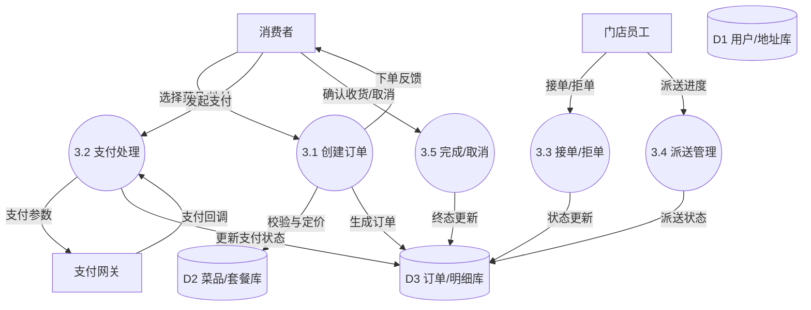
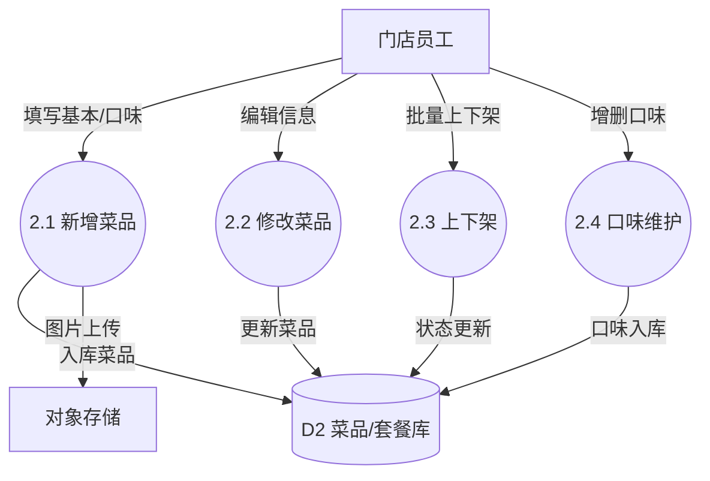
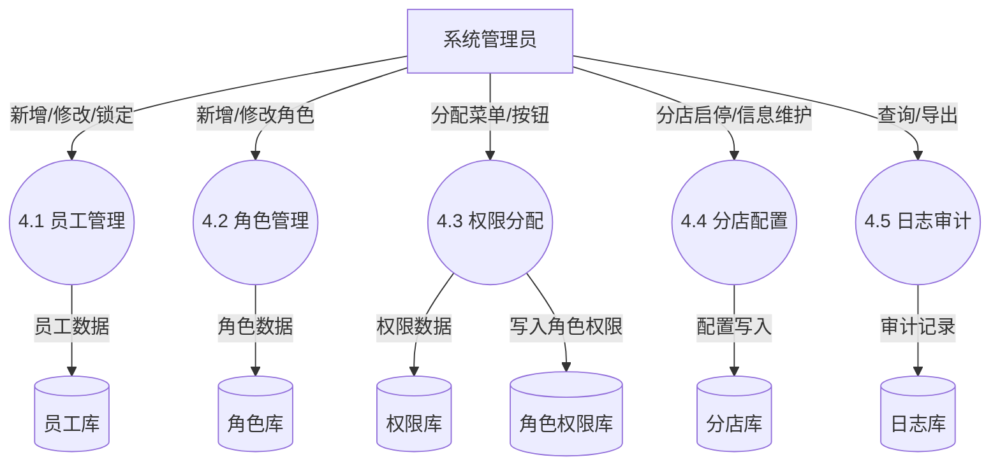
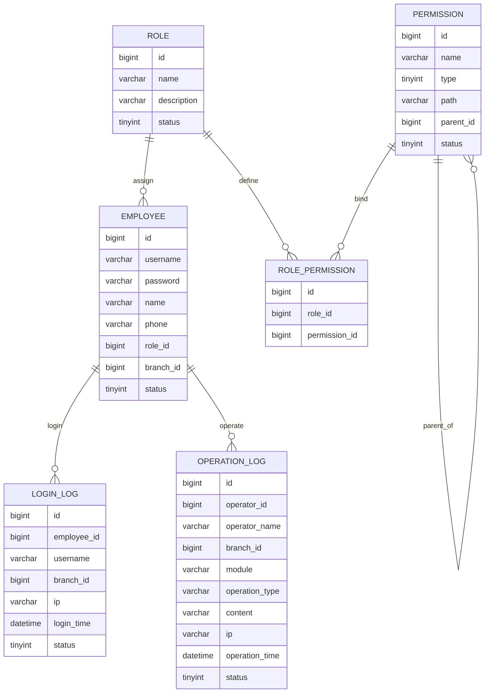
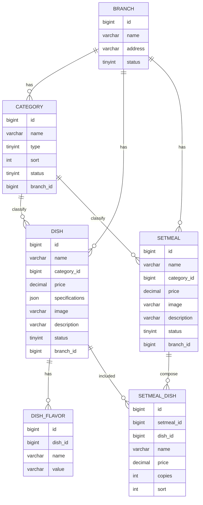
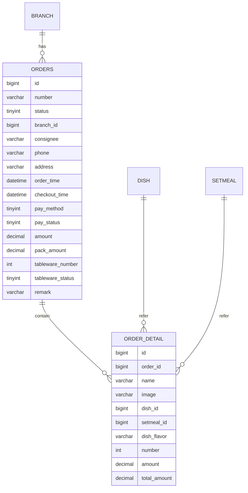
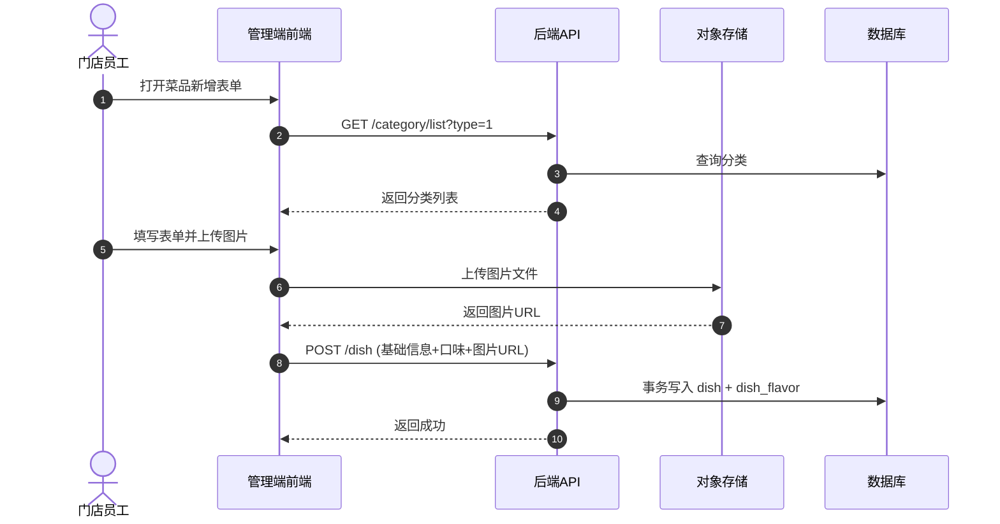
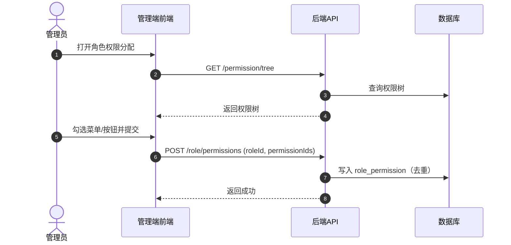

# 系统分化设计文档（Level-1 DFD / 业务域ER / 时序图）

## 一、数据流分解（Level-1 DFD）

### 1.1 订单处理 1层DFD

### 1.2 菜品管理 1层DFD

### 1.3 系统管理 1层DFD

## 二、业务域 ER 子图

### 2.1 账户与权限域

### 2.2 商品域

### 2.3 订单域

## 三、关键模块时序图

### 3.1 菜品新增

### 3.2 权限分配

