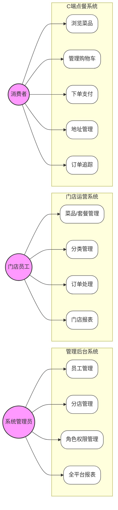
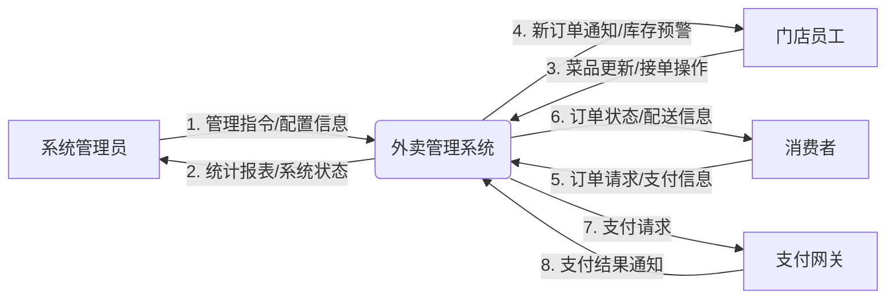
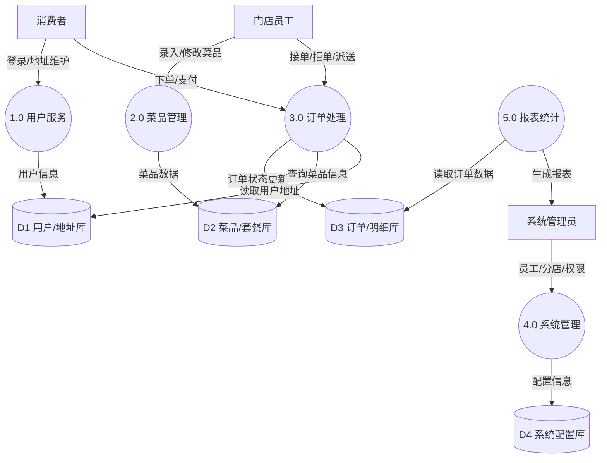
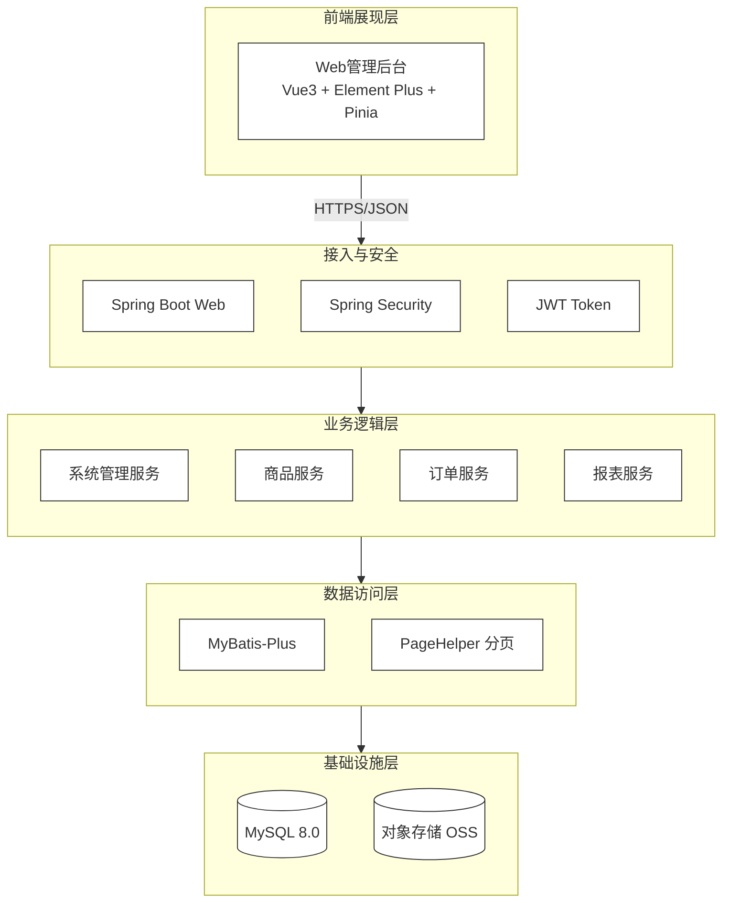
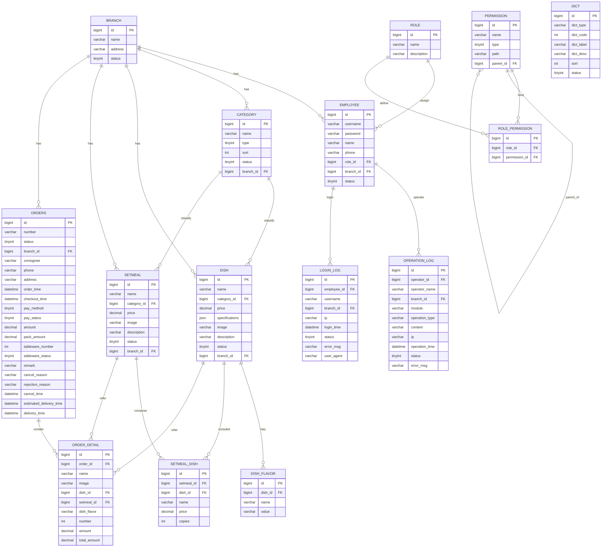
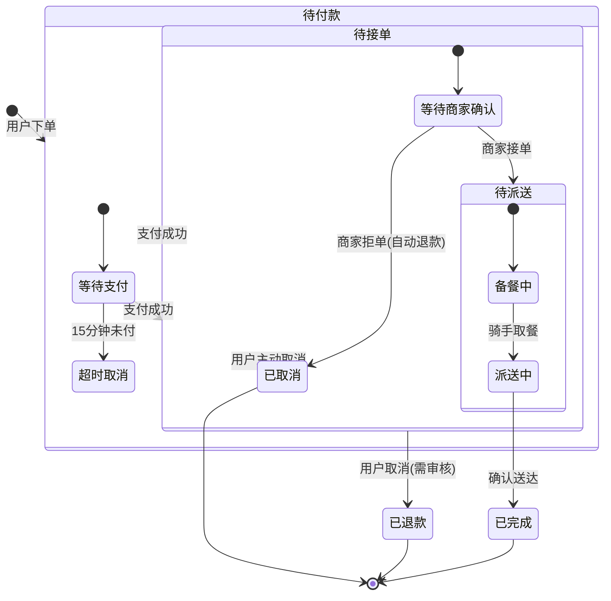
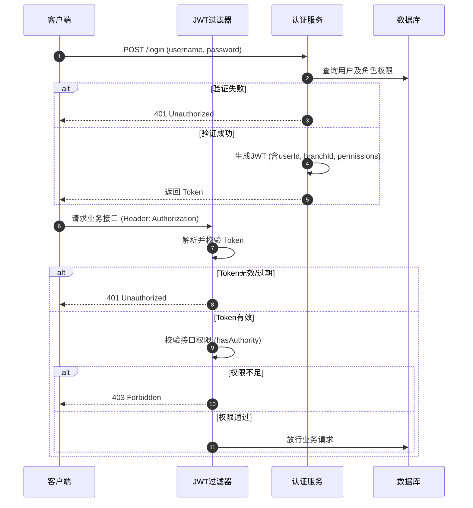

# 外卖管理系统 - 系统分析与设计说明书

## 1. 引言

### 1.1 背景与意义
随着移动互联网的普及和O2O（Online To Offline）商业模式的成熟，餐饮外卖已成为人们日常生活中不可或缺的一部分。为了提高餐饮企业的运营效率、降低管理成本并提升用户体验，开发一套功能完善、架构先进的外卖管理系统显得尤为重要。本系统旨在为餐饮商家提供全方位的数字化解决方案，覆盖从菜品管理、订单处理到数据分析的全链路业务。系统支持多门店管理模式，实现了总店对分店的统一管控以及分店数据的独立运营。

### 1.2 文档范围
本文档详细描述了外卖管理系统的需求分析、系统架构设计、数据库设计及详细功能设计，旨在为系统的开发、测试及后续维护提供核心依据。文档涵盖了完整的ER图、数据流图（DFD）、数据字典以及核心业务的处理逻辑。

---

## 2. 需求分析

### 2.1 用户角色定义
系统主要包含以下三类用户角色：
1.  **系统管理员 (Admin)**: 拥有系统最高权限，负责门店管理、员工管理、角色权限分配及全局数据监控。
2.  **门店员工 (Employee)**: 负责具体门店的日常运营，包括菜品维护、订单接单、配送管理、分类管理等。数据权限受限于所属分店。
3.  **消费者 (User)**: 通过C端应用进行浏览菜品、管理购物车、下单支付、订单追踪、地址管理等操作。

### 2.2 核心业务用例分析 (Use Case)

下图展示了系统主要角色的核心业务用例。

### 2.3 数据流图 (Data Flow Diagram)

#### 2.3.1 顶层数据流图 (Context Diagram)
展示系统与外部实体之间的最高层级数据交互。

#### 2.3.2 0层数据流图 (Level-0 DFD)
展示系统内部主要子系统之间的数据流向。

---

## 3. 系统架构设计

### 3.1 技术架构设计
系统采用前后端分离的分层架构，后端为 Spring Boot + MyBatis-Plus，未使用 Redis。

### 3.2 功能结构图

```mermaid
graph TB
    System(外卖管理系统)
    
    subgraph AdminModule [管理端模块]
        SysMgt(系统管理)
        BizMgt(业务管理)
        OrderMgt(订单中心)
        DataMgt(数据报表)
    end

    subgraph UserModule [用户端模块]
        UserCenter(个人中心)
        Ordering(点餐功能)
    end

    System --> AdminModule
    System --> UserModule

    SysMgt --> EmpMgt[员工管理]
    SysMgt --> BranchMgt[分店管理]
    SysMgt --> RoleMgt[角色权限]
    SysMgt --> LogMgt[日志审计]

    BizMgt --> CategoryMgt[分类管理]
    BizMgt --> DishMgt[菜品管理]
    BizMgt --> SetmealMgt[套餐管理]

    OrderMgt --> WaitPay[待付款]
    OrderMgt --> WaitOrder[待接单]
    OrderMgt --> WaitDelivery[待派送]
    OrderMgt --> Delivering[派送中]
    OrderMgt --> Completed[已完成]
    OrderMgt --> Cancelled[已取消]

    DataMgt --> Turnover[营业额统计]
    DataMgt --> UserStat[用户统计]
    DataMgt --> OrderStat[订单统计]
    DataMgt --> Top10[销量排名]

    UserCenter --> AddressMgt[地址管理]
    UserCenter --> OrderHistory[历史订单]

    Ordering --> DishBrowse[菜品浏览]
    Ordering --> CartMgt[购物车]
    Ordering --> Pay[下单支付]
```

---

## 4. 数据库设计

### 4.1 全局ER图 (Entity-Relationship Diagram)
本系统遵循第三范式设计，核心实体包括分店、员工、角色、菜品、订单等。以下是完整的实体关系图。

### 4.2 数据字典 (Data Dictionary)

#### 4.2.1 分店表 (branch)
| 字段名 | 类型 | 长度 | 允许空 | 描述 |
| :--- | :--- | :--- | :--- | :--- |
| id | BIGINT | 20 | N | 主键，自增 |
| name | VARCHAR | 64 | N | 分店名称 |
| address | VARCHAR | 255 | N | 分店地址 |
| contact_name | VARCHAR | 32 | N | 联系人 |
| contact_phone | VARCHAR | 11 | N | 联系电话 |
| status | TINYINT | 4 | N | 状态：1-启用 0-禁用 |
| is_deleted | TINYINT | 4 | N | 逻辑删除：1-已删 0-未删 |

#### 4.2.2 员工表 (employee)
| 字段名 | 类型 | 长度 | 允许空 | 描述 |
| :--- | :--- | :--- | :--- | :--- |
| id | BIGINT | 20 | N | 主键，自增 |
| username | VARCHAR | 32 | N | 用户名 (Unique) |
| password | VARCHAR | 64 | N | 密码 (BCrypt加密) |
| name | VARCHAR | 32 | N | 姓名 |
| role_id | BIGINT | 20 | N | 关联角色ID |
| branch_id | BIGINT | 20 | N | 关联分店ID |
| status | TINYINT | 4 | N | 状态：1-正常 0-锁定 |

#### 4.2.3 角色表 (role)
| 字段名 | 类型 | 长度 | 允许空 | 描述 |
| :--- | :--- | :--- | :--- | :--- |
| id | BIGINT | 20 | N | 主键，自增 |
| name | VARCHAR | 32 | N | 角色名称 |
| description | VARCHAR | 128 | Y | 描述 |

#### 4.2.4 权限表 (permission)
| 字段名 | 类型 | 长度 | 允许空 | 描述 |
| :--- | :--- | :--- | :--- | :--- |
| id | BIGINT | 20 | N | 主键 |
| name | VARCHAR | 32 | N | 权限名称 |
| type | TINYINT | 4 | N | 类型：1-菜单 2-按钮 |
| path | VARCHAR | 64 | Y | 路由/标识 |
| parent_id | BIGINT | 20 | Y | 父权限ID |

#### 4.2.5 菜品表 (dish)
| 字段名 | 类型 | 长度 | 允许空 | 描述 |
| :--- | :--- | :--- | :--- | :--- |
| id | BIGINT | 20 | N | 主键 |
| name | VARCHAR | 32 | N | 菜品名称 |
| category_id | BIGINT | 20 | N | 分类ID |
| price | DECIMAL | 10,2 | N | 价格 |
| image | VARCHAR | 255 | Y | 图片URL |
| status | TINYINT | 4 | N | 1-起售 0-停售 |
| branch_id | BIGINT | 20 | N | 所属分店 |

#### 4.2.6 订单表 (orders)
| 字段名 | 类型 | 长度 | 允许空 | 描述 |
| :--- | :--- | :--- | :--- | :--- |
| id | BIGINT | 20 | N | 主键 |
| number | VARCHAR | 50 | N | 订单号 |
| status | TINYINT | 4 | N | 1-待付 2-待接 3-已接 4-派送 5-完成 6-取消 |
| branch_id | BIGINT | 20 | N | 分店ID |
| user_id | BIGINT | 20 | N | 用户ID |
| amount | DECIMAL | 10,2 | N | 总金额 |
| order_time | DATETIME | - | N | 下单时间 |

#### 4.2.7 订单明细表 (order_detail)
| 字段名 | 类型 | 长度 | 允许空 | 描述 |
| :--- | :--- | :--- | :--- | :--- |
| id | BIGINT | 20 | N | 主键 |
| order_id | BIGINT | 20 | N | 订单ID |
| dish_id | BIGINT | 20 | Y | 菜品ID |
| setmeal_id | BIGINT | 20 | Y | 套餐ID |
| name | VARCHAR | 32 | N | 商品名称 |
| number | INT | 11 | N | 数量 |
| amount | DECIMAL | 10,2 | N | 单价 |

#### 4.2.8 套餐表 (setmeal)
| 字段名 | 类型 | 长度 | 允许空 | 描述 |
| :--- | :--- | :--- | :--- | :--- |
| id | BIGINT | 20 | N | 主键 |
| name | VARCHAR | 32 | N | 套餐名称 |
| category_id | BIGINT | 20 | N | 分类ID |
| price | DECIMAL | 10,2 | N | 价格 |
| status | TINYINT | 4 | N | 1-起售 0-停售 |
| branch_id | BIGINT | 20 | N | 分店ID |

#### 4.2.9 菜品口味表 (dish_flavor)
| 字段名 | 类型 | 长度 | 允许空 | 描述 |
| :--- | :--- | :--- | :--- | :--- |
| id | BIGINT | 20 | N | 主键 |
| dish_id | BIGINT | 20 | N | 菜品ID |
| name | VARCHAR | 32 | N | 口味名称 |
| value | VARCHAR | 255 | N | 口味值(JSON/List) |

#### 4.2.10 操作日志表 (operation_log)
| 字段名 | 类型 | 长度 | 允许空 | 描述 |
| :--- | :--- | :--- | :--- | :--- |
| id | BIGINT | 20 | N | 主键 |
| operator_id | BIGINT | 20 | N | 操作人ID |
| module | VARCHAR | 32 | N | 模块 |
| operation_type | VARCHAR | 16 | N | 类型 |
| content | VARCHAR | 255 | N | 内容 |
| status | TINYINT | 4 | N | 1-成功 0-失败 |

#### 4.2.11 登录日志表 (login_log)
| 字段名 | 类型 | 长度 | 允许空 | 描述 |
| :--- | :--- | :--- | :--- | :--- |
| id | BIGINT | 20 | N | 主键 |
| employee_id | BIGINT | 20 | N | 员工ID |
| ip | VARCHAR | 32 | N | IP地址 |
| status | TINYINT | 4 | N | 1-成功 0-失败 |
| login_time | DATETIME | - | N | 登录时间 |

---

#### 4.2.12 分类表 (category)
| 字段名 | 类型 | 长度 | 允许空 | 描述 |
| :--- | :--- | :--- | :--- | :--- |
| id | BIGINT | 20 | N | 主键 |
| name | VARCHAR | 32 | N | 分类名称 |
| type | TINYINT | 4 | N | 1-菜品 2-套餐 |
| sort | INT | 11 | N | 排序值 |
| status | TINYINT | 4 | N | 1-启用 0-禁用 |
| branch_id | BIGINT | 20 | N | 分店ID |

#### 4.2.13 套餐菜品关系表 (setmeal_dish)
| 字段名 | 类型 | 长度 | 允许空 | 描述 |
| :--- | :--- | :--- | :--- | :--- |
| id | BIGINT | 20 | N | 主键 |
| setmeal_id | BIGINT | 20 | N | 套餐ID |
| dish_id | BIGINT | 20 | N | 菜品ID |
| name | VARCHAR | 32 | N | 菜品名称(冗余) |
| price | DECIMAL | 10,2 | N | 单价(冗余) |
| copies | INT | 11 | N | 份数 |
| sort | INT | 11 | N | 排序值 |

#### 4.2.14 角色权限关联表 (role_permission)
| 字段名 | 类型 | 长度 | 允许空 | 描述 |
| :--- | :--- | :--- | :--- | :--- |
| id | BIGINT | 20 | N | 主键 |
| role_id | BIGINT | 20 | N | 角色ID |
| permission_id | BIGINT | 20 | N | 权限ID |

#### 4.2.15 数据字典表 (dict)
| 字段名 | 类型 | 长度 | 允许空 | 描述 |
| :--- | :--- | :--- | :--- | :--- |
| id | BIGINT | 20 | N | 主键 |
| dict_type | VARCHAR | 32 | N | 字典类型 |
| dict_code | INT | 11 | N | 字典编码 |
| dict_label | VARCHAR | 32 | N | 字典标签 |
| dict_desc | VARCHAR | 128 | Y | 字典描述 |
| sort | INT | 11 | N | 排序值 |
| status | TINYINT | 4 | N | 1-启用 0-禁用 |

## 5. 详细设计与处理逻辑

### 5.1 订单全流程处理逻辑
订单是系统的核心业务对象，其状态流转涉及用户、商家、支付网关和配送系统。

**处理逻辑说明：**
1.  **下单**: 用户提交订单时，系统需校验商品库存、状态（是否停售）及店铺营业状态。库存扣减采用数据库事务与乐观锁/行级锁防止超卖。
2.  **支付**: 订单创建后进入"待付款"状态，设置15分钟超时TTL。超时未付自动取消。支付成功后回调更新状态为"待接单"。
3.  **接单**: 商家端通过WebSocket接收新订单提醒。商家可"接单"（转为"制作中/待派送"）或"拒单"（触发自动退款流程）。
4.  **配送**: 状态流转为"派送中"，记录预计送达时间。
5.  **完成**: 用户点击确认收货或系统自动确认（派送后X小时），订单状态转为"已完成"。

**状态流转图：**

### 5.2 菜品/套餐管理逻辑
菜品管理涉及多级关联（分类->菜品->口味）和分店数据隔离。

**处理逻辑说明：**
1.  **新增菜品**: 
    *   必须选择所属分类。
    *   若为非管理员操作，自动关联当前登录用户的 `branch_id`。
    *   支持动态添加口味配置（如：辣度、甜度），数据存入 `dish_flavor` 表。
    *   支持图片上传至OSS对象存储。
2.  **修改菜品**: 
    *   修改时需先回显当前菜品信息及关联口味。
    *   修改操作包含：更新基本信息、删除旧口味、插入新口味（事务操作）。
3.  **停售/起售**: 
    *   批量操作状态字段。
    *   套餐中若包含停售菜品，该套餐也应自动标识为不可售（业务逻辑校验）。

### 5.3 数据权限控制逻辑 (Data Isolation)
系统严格执行基于分店的数据隔离策略。

**处理逻辑说明：**
1.  **管理员视图**: 
    *   可以看到所有分店的数据。
    *   查询时可通过下拉框筛选 `branch_id`。
2.  **分店员工视图**: 
    *   登录时生成JWT Token，Payload中包含 `branch_id`。
    *   后端MyBatis Plus拦截器自动注入 `WHERE branch_id = ?` 条件，强制过滤数据。
    *   前端表单在新增数据时，自动填充当前用户的 `branch_id` 且不可修改。

### 5.4 登录认证与权限鉴权逻辑
基于 Spring Security + JWT 实现无状态认证。

**处理流程：**

